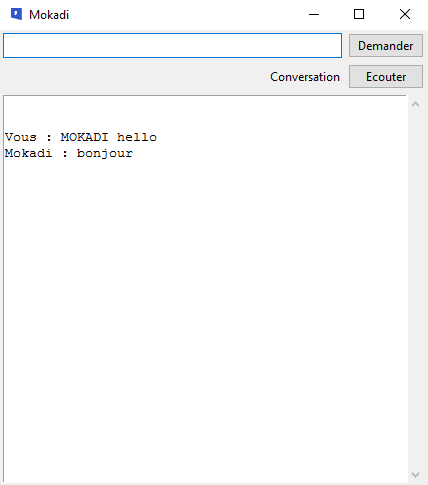

.. _l-devoxx2017:

Devoxx 06/04/2017
=================

.. sharenet::
    :facebook: 1
    :linkedin: 2
    :twitter: 3
    :head: False

La présentation abordait le thème de l'intelligence artificielle.
Je ne décrirai pas ici le contenu de la présentation pour plus parler
de la petite démo que j'ai préparé pour cet événement.

.. image:: mokadi.png

J'ai conçu un petit `BOT <https://fr.wikipedia.org/wiki/Bot_informatique>`_
qui exécute pour moi des tâches que je fais tous les jours. Il m'écoute ma voix,
la traduit sous forme de texte grâce aux
`Cognitives Services de Microsoft <https://www.microsoft.com/cognitive-services/en-us/apis>`_.
Il utilise ensuite une grammaire pour tagger chaque mot et l'aiguiller vers la bonne
commande (lire des mails, une présentation, wikipédia, les nouvelles ou la détection
d'une émotion). Le BOT se lance avec la commande suivante :

::

    python -u -c "from jupytalk import launch_gui_mokadi;launch_gui_mokadi()"

Le code est disponible sur GitHub
`jupytalk/mokadi <https://github.com/sdpython/jupytalk/tree/master/src/jupytalk/mokadi>`_.
Les tests unitaires sont aussi sur GitHub
`_unittests/ut_mokadi <https://github.com/sdpython/jupytalk/tree/master/_unittests/ut_mokadi>`_.

L'application ne marche que sous Windows pour le moment et sans doute pour un bon
moment car dans les quelques jours que j'ai utilisés pour implémenter l'application,
j'ai conservé quelques exemples de code en C# que j'ai mis dans le module
`ensae_teaching_cs <https://github.com/sdpython/ensae_teaching_cs/tree/master/helpers/cs/ENSAE.Voice>`_
et convertis en Python à
`ensae_teaching_cs/pythonnet/__init__ <https://github.com/sdpython/ensae_teaching_cs/blob/master/src/ensae_teaching_cs/pythonnet/__init__.py>`_.
