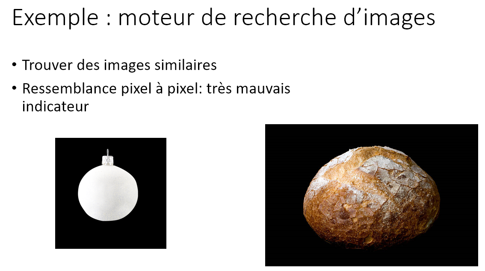
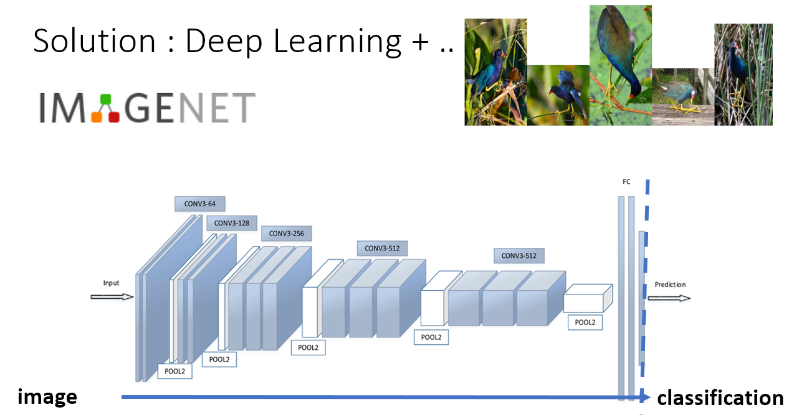
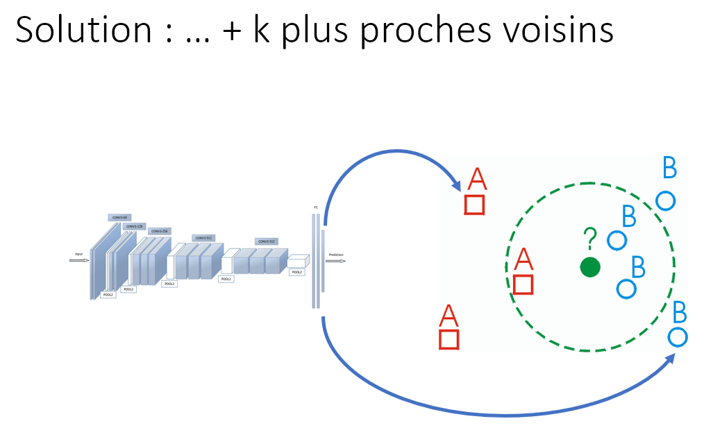
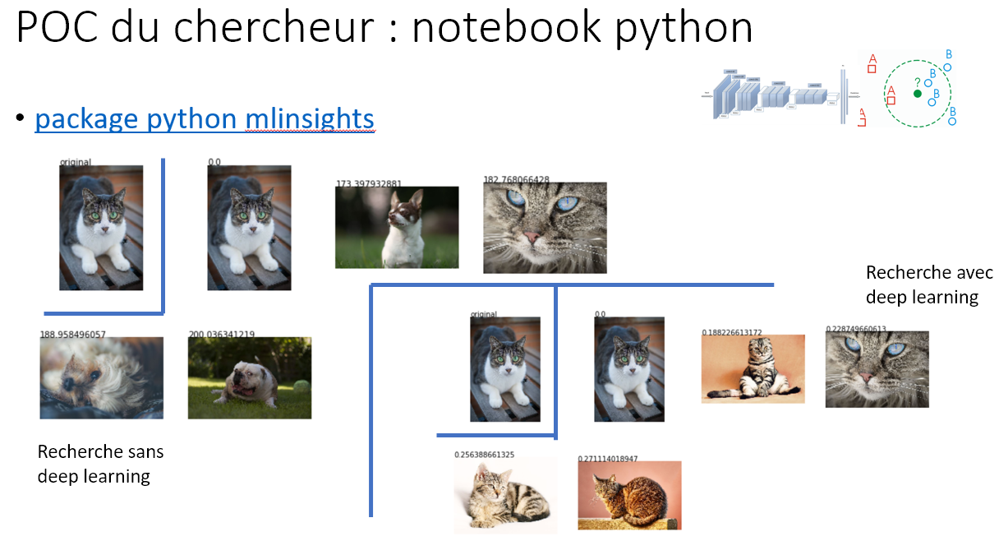
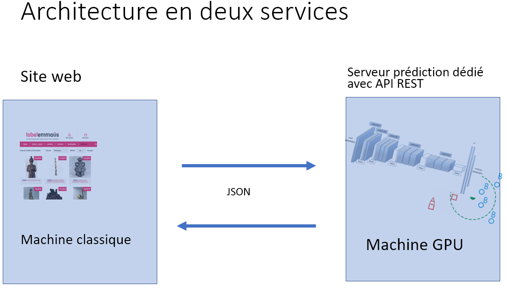
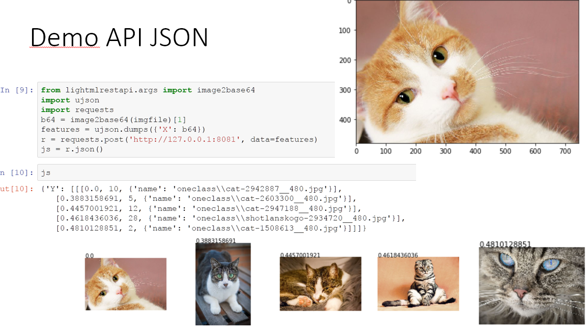

.. _l-oss2017:

Comment opérationnaliser un modèle de machine learning
======================================================

.. sharenet::
    :facebook: 1
    :linkedin: 2
    :twitter: 3
    :head: False

.. contents::
    :local:

Slides en vrac
--------------

Liens vers les notebooks et le code
-----------------------------------

* `POC : Search images with deep learning <http://www.xavierdupre.fr/app/mlinsights/helpsphinx/notebooks/search_images.html#searchimagesrst>`_
* `mlprodict: un exemple de régression logistique en C++ <http://www.xavierdupre.fr/app/mlprodict/helpsphinx/index.html>`_
* `REST API avec une image <http://www.xavierdupre.fr/app/lightmlrestapi/helpsphinx/i_ex.html#index-exref-0-0>`_
* `POC : Search engines for images through a REST API <http://www.xavierdupre.fr/app/ensae_projects/helpsphinx/gyexamples/plot_rest_api_search_images.html#sphx-glr-gyexamples-plot-rest-api-search-images-py>`_
* `Code sur GitHub 2017_deeplearning_demo/search_images <https://github.com/sdpython/2017_deeplearning_demo/tree/master/search_images>`_
